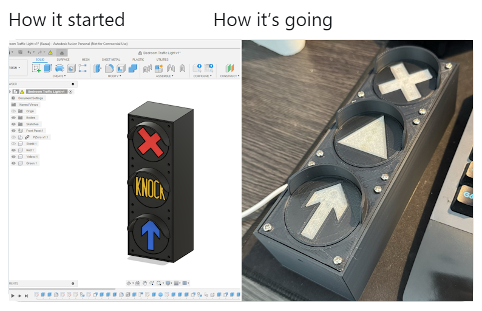

# Semafor

This is the code and resources for a wee traffic light project I'm working on.

I've already built it, but I need to put together some nice photos of it. Here's a link to the [hardware README](hardware/README.md) if you want to build your own.

## Licence

This is a hobby project, and I encourage you to copy it and do whatever, but please credit, share alike and all that:

[Software](semafor) is licenced under the [GNU Affero General Public License v3+](LICENCE.AGPLv3+)

Everything else is [CC BY-SA 4.0](LICENCE.CC-BY-SA-4).
