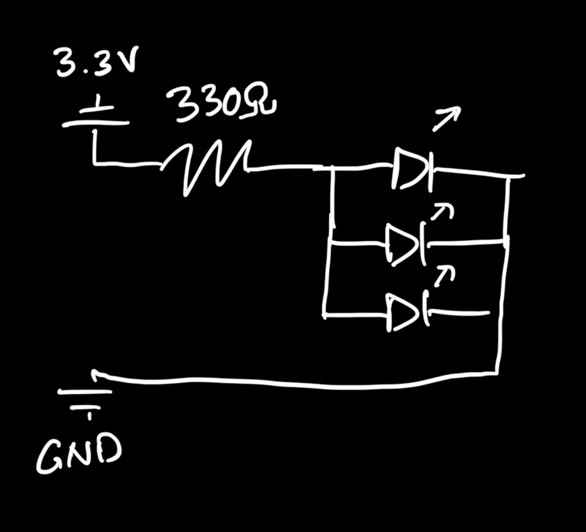
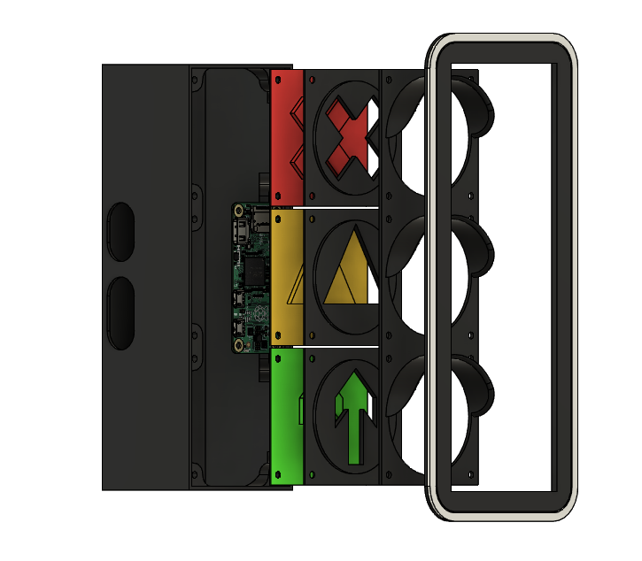

# Semafor Hardware

## Bill of Meterials

Below are the things I used to put it together.

- 3D Printing Filament

  - Black PLA
  - Translucent PETG

- Electronics

  - [Raspberry Pi Zero W](https://www.pbtech.co.nz/product/SEVRBP0412/Raspberry-Pi-Zero-W-1GHz-BCM2835-Single-Core-CPU-5) with GPIO headers, and an SD card
  - [LEDs](https://www.aliexpress.com/item/1005003323707856.html)
    - 5x Red LEDs
    - 4x Yellow LEDs
    - 4x Green LEDs
  - [Prototype boards](https://www.aliexpress.com/item/1005006046334726.html)
    - 1x 2x8cm
    - 1x 3x7cm
  - 3x 330&Omega; resistors
  - [Any to Female Dupont Cable](https://www.aliexpress.com/item/1005005501503609.html)

- a number of M3x6mm and M3x10mm screws

## Build Instrucutions

### LED Assemblies

The clear LED prints show what the spacing between the LEDs should be. Place them on the prototype-boards accordingly and connect them in parallel.

Add a 330&Omega; resistor in between the 3.3V power input and the LED power rail.

The power cables have a female Dupont connector on the Raspberry Pi end so they can be replace should the LEDs burn out, or a new design is desired.

Use [hot glue liberally](images/hot-glue.png) (optional, but I didn't have my own custom printed PCBs and didn't want to short anything by accident).

### Main Assembly

1. Install the Raspberry Pi Zero into the Enclosure with 4 M3x6mm screws
2. Connect the LED assemblies to the following pins:
   - Red to [GPIO 17](https://pinout.xyz/pinout/pin11_gpio17/)
   - Yellow to [GPIO 27](https://pinout.xyz/pinout/pin13_gpio27/)
   - Green to [GPIO 22](https://pinout.xyz/pinout/pin15_gpio22/)
   - Grounds to [any ground pin](https://pinout.xyz/pinout/ground)
3. You may want to boot up the Pi and make sure everything works\
   (You can just use Python and the builtin `gpiozero` library)
4. Place the LED masks and front panel over the front.
5. Screw in place with 12 M3x6mm
